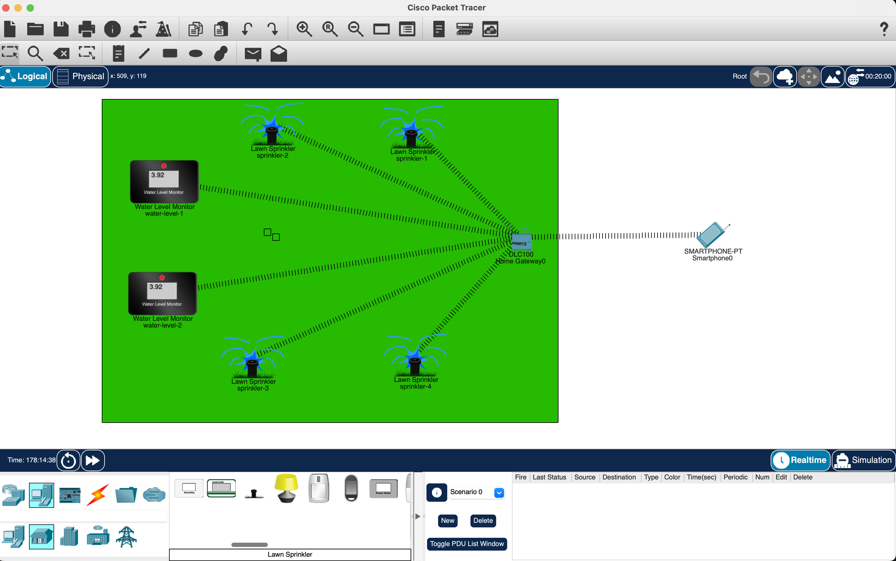

# 🌱 Smart Irrigation System using Cisco Packet Tracer

## 📌 Aim
Design and simulate a smart irrigation system in Cisco Packet Tracer to optimize water usage by monitoring soil moisture levels and automatically triggering irrigation when the moisture drops below a set threshold.

---

## 📝 Problem Statement
Excessive or insufficient watering in agricultural fields leads to water wastage, reduced crop yields, and soil degradation. A smart irrigation system is needed to automate the watering process based on real-time soil moisture data, ensuring efficient water usage and sustainable farming practices. This project focuses on designing and simulating such a system entirely within Cisco Packet Tracer.

---

## 🌐 Scope of the Solution
This smart irrigation system monitors soil moisture levels using two water level sensors and automatically triggers any of the four lawn sprinklers connected via an IoT Home Gateway. A smartphone allows remote monitoring or manual control of the irrigation system. The solution ensures optimal water usage by activating sprinklers only when the moisture level drops below a set threshold, helping conserve water and improve crop health.

---

## 🏗️ Overview / Architecture of the Solution
The system architecture, as designed in Cisco Packet Tracer, includes:

1. **Water Level Monitors (Moisture Sensors):**
   - `water-level-1` and `water-level-2` measure soil moisture.
   - Sensors send real-time data to the Home Gateway.

2. **Lawn Sprinklers (Actuators):**
   - `sprinkler-1` through `sprinkler-4` are connected to the gateway.
   - They receive commands to start or stop irrigation based on sensor readings.

3. **IoE Gateway (Home Gateway):**
   - The central controller (`Home Gateway0`) collects sensor data and sends activation signals to the sprinklers.
   - Serves as the network hub connecting sensors, actuators, and smartphone.

4. **Smartphone:**
   - Connected to the gateway, enabling remote monitoring and manual override of sprinkler operations.

---

## 🛠️ Required Components
To build and simulate this smart irrigation system in Cisco Packet Tracer, you will need:

- **2× IoT Water Level Monitors** (simulated moisture sensors)
- **4× IoT Lawn Sprinklers** (actuators)
- **1× Home Gateway (IoE Gateway)**
- **1× Smartphone (IoT-enabled)**
- **Wired or Wireless connections** (as shown in the logical circuit)
- **Cisco Packet Tracer software** (latest version recommended)
- **Logical Circuit Screenshot** (included in this repository for documentation)

---

## 🖥️ Setup Instructions
1. Open Cisco Packet Tracer and recreate the logical circuit as per the screenshot.
2. Connect the water level monitors and lawn sprinklers to the Home Gateway.
3. Configure the Home Gateway to receive data from the sensors and send commands to the sprinklers.
4. Connect the smartphone to the Home Gateway to enable remote control and monitoring.
5. Set the moisture threshold values in the Home Gateway’s logic to trigger sprinklers automatically.
6. Run the simulation in **Realtime** or **Simulation Mode** to observe automatic irrigation based on sensor readings.

---

## 📸 Simulated Circuit Screenshot
 <!-- Replace path with your uploaded image location -->

---

## 🎥 Demo Video
Simulation video has been uploaded.

---

## ✅ Conclusion
This simulation demonstrates how IoT can optimize water management in agriculture, ensuring efficient irrigation based on real-time soil moisture levels, reducing water wastage, and supporting sustainable farming practices.

---

